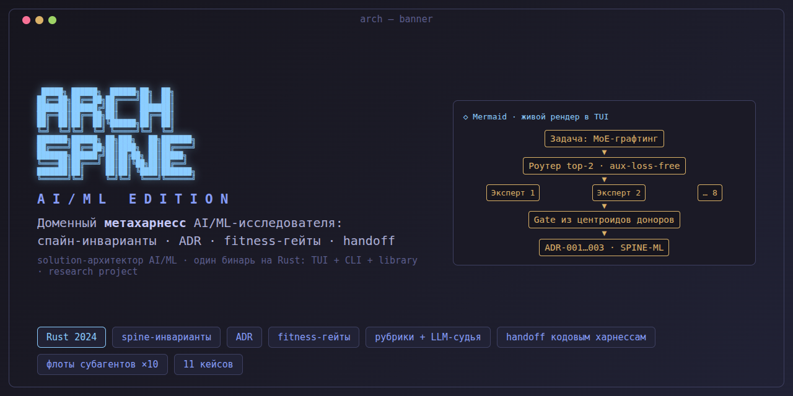
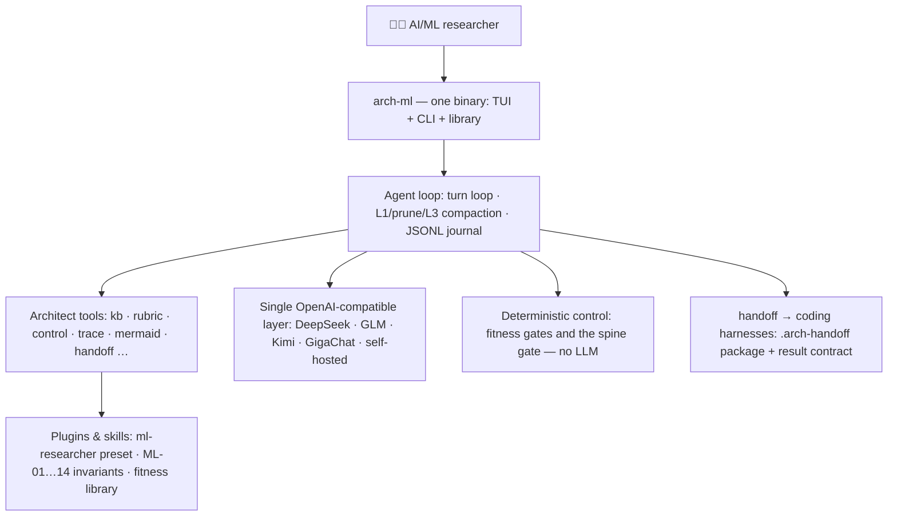

# Spine AI/ML Edition

<p align="center">
  
</p>

<p align="center">
  <b>A domain meta-harness for AI/ML researchers, sitting above coding harnesses</b><br>
  <sub>spine invariants · ADRs · fitness gates · rubrics with an evidence-bound LLM judge · handoff to coding harnesses · sub-agent fleets<br>
  One Rust binary, <code>arch-ml</code>: TUI + CLI + library.</sub>
</p>

<p align="center">
  <a href="https://github.com/romannekrasovaillm/spine-aiml/actions/workflows/ci.yml"></a>
  <a href="https://github.com/romannekrasovaillm/spine-aiml/releases"></a>
  
  
  
</p>

<p align="center">
  <b>🇷🇺 <a href="README.md">Русский</a></b> · <b>🇬🇧 English</b> · <b>🧪 <a href="#cases">Cases</a></b> · <b>✨ <a href="docs/features.md">Full feature tour</a></b>
</p>

---

<p align="center">
  
</p>

## ⚡ Try it in 5 minutes

```bash
cargo build --release          # binary: target/release/arch-ml
ln -sf "$PWD/target/release/arch-ml" ~/.local/bin/arch-ml   # one-word launch
arch-ml init                   # config + assets into ~/.arch-ml and ~/.config/arch-ml/
```

A prebuilt binary ships with every [GitHub Release](https://github.com/romannekrasovaillm/spine-aiml/releases)
(`arch-ml-linux-x86_64` + SHA256SUMS + SBOM). Everything below works
**without API keys or network** (the deterministic layer, AD-2):

```bash
arch-ml doctor                                # 11 environment checks
cd examples/ml-experiment
arch-ml control check . --constraints CONSTRAINTS.yaml   # FAIL: no seed/manifest/budget
cp fix/train.py train.py && cp fix/run-manifest.yaml run-manifest.yaml
arch-ml control check . --constraints CONSTRAINTS.yaml   # PASS — the ML-06/ML-09 gate in action
arch-ml mermaid ../mermaid/ml-pipeline.mmd    # diagram → ASCII in your terminal
arch-ml control score --trigger new_component=true       # significance routing
```

With any OpenAI-compatible provider key (`DEEPSEEK_API_KEY`,
`ZHIPU_API_KEY`, `KIMI_API_KEY`, …) the agent layer unlocks:

```bash
arch-ml                                        # interactive TUI
arch-ml run -q "draft an ADR comparing LoRA vs full fine-tune" > adr.md
```

Detailed setup: [docs/getting_started.md](docs/getting_started.md).

## What is this

**Spine AI/ML Edition** is a thin agent harness that sits *above* coding
harnesses (Claude Code, Kimi Code, Qwen Code, Theseus and others) and runs
ML research as an engineering discipline rather than a chain of notebooks.
Four pillars:

1. **Domain preset `ml-researcher`** (`aiml/presets/ml-researcher/`) — a
   three-tier model matrix with sensitivity routing (private input goes only
   to local models, ML-02).
2. **Perimeter invariants ML-01…ML-14** (`SPINE-ML.md`) — executable fitness
   rules, not prose: private perimeter for datasets and weights, run
   reproducibility (config + versions + seed in the manifest),
   dataset/checkpoint provenance, run budget with a cost ceiling, honest
   reporting of measured vs assumed.
3. **8 domain plugins** (`aiml/plugins/`): network design, LLM grafting,
   continual learning, RL environments, selfplay contracts, a small-model
   ladder for GB10/DGX Spark, hypothesis routing.
4. **Intention memory** (`HYPOTHESIS.md`, ADR-047): a hypothesis card
   surfaces itself from project facts — no searching.

The harness is deliberately thin: the heavy lifting is artifact discipline
(spine invariants with `Binds`/`Prevents`/`Rule`, ADRs before
implementation, evidence with quotes, machine-checkable fitness functions),
not code. Idea sources: `docs/SOURCE_BRIEF.md`. Forked from the banking
line of Spine — see `NOTICE.md`; the core is MIT-licensed.

## 🧪 Cases — end-to-end runs, not promises

Each case is a self-contained sample of architect work with the harness:
from spine invariants to a coding-harness handoff package. Registry and
conventions: [`кейсы/AGENTS.md`](кейсы/AGENTS.md).

| Case | Model | What it shows |
|------|-------|----------------|
| [laguna-compact](кейсы/laguna-compact/) | Qwen2.5 (GB10) | The CPT→SFT→RL ladder on a single GPU: resource guards, corpus revisions, single-seed pilot |
| [kimi-killer](кейсы/kimi-killer/) | — (pretrain) | A bake-off of long-context architectures: one run contract, mechanical verdict, private corpus never leaves the perimeter |
| [drift-control](кейсы/drift-control/) | Claude Code (A/B) | Bare task → gate FAIL 2/6; same task + handoff package → PASS 6/6 |
| [parallel-epics](кейсы/parallel-epics/) | Claude Code ×3 | Parallel worktree fleet: seams converged on the first build (15/15 tests) |
| [fleet-of-ten](кейсы/fleet-of-ten/) | Claude Code ×10 | Ten epics in ~3.2 min wall clock: 10/10 complete, the fleet committed its own work |
| [fleet-spine-drift](кейсы/fleet-spine-drift/) | — (mechanical) | Fleet audit: 66.7% duplicates and `CONSTRAINTS.yaml` drift as exit codes |
| [fleet-patterns](кейсы/fleet-patterns/) | — (mechanical) | Fleet orchestration engine: fanout / pipeline / map_reduce / tournament / dag |
| [legacy-survey](кейсы/legacy-survey/) | — (mechanical) | Reverse discovery of a legacy monolith: hidden couplings as `[confirmed]`, honest `[gap]`s |
| [jvm-archunit-gate](кейсы/jvm-archunit-gate/) | — (mechanical) | One `CONSTRAINTS.yaml` — two executors: the native gate and real ArchUnit over bytecode |
| [sbp-gateway](кейсы/sbp-gateway/) | DeepSeek V4 Flash | Full cycle: spine → solutioning → ADRs → contracts/NFR → coding-harness handoff |
| [payment-processing-platform](кейсы/payment-processing-platform/) | GLM-5.2 | Critical-route greenfield in one session: 27 invariants, 16 ADRs |
| [govproc-platform](кейсы/govproc-platform/) | Kimi K3 | Compact kit: 7 ADs, 5 ADRs, an OpenAPI contract as a first-class artifact |

### 🏗 Architecture in 10 seconds



## Feature highlights

The full tour (RU + EN, mechanism by mechanism) lives in
[docs/features.md](docs/features.md).

- **Models & reasoning**: DeepSeek V4/V4.1, GLM-5.3/5.2 (1M-token window),
  Kimi K3, any OpenAI-compatible endpoint; `/think on|off|auto` toggle,
  vision (`screenshot`/`read_image`), computer and browser control
  (classified `Destructive`, off by default).
- **Skills library**: 9 built-in plugins (61 skills) + 8 domain AI/ML
  plugins; `arch-ml skills search/show`, distillation of articles into
  skills.
- **Executor fleets**: background sub-agents, ralph loops, a worktree
  factory, pattern-based orchestration (ADR-042) with mechanical node gates.
- **Governance**: R0–R5 autonomy levels, Evidence Bundle as a release gate,
  metrics (incl. an approval-theater detector and KV-cache hit-rate by model
  and session), OpenSpec delta-specs.
- **LLM-free architecture control**: `control check` (fitness),
  `control score` (significance routing with git-diff anti-bypass),
  `trace check`, `nfr budget/availability/capacity/cost`, an ArchUnit bridge
  for JVM, corporate spine with layered rule inheritance.
- **Architecture model**: typed entities (CAP/SYS/CMP/INT/NFR/ADR…),
  referential integrity, export to Structurizr/PlantUML/drawio, ArchiMate.
- **Handoff to coding harnesses**: `.arch-handoff/` package with a result
  contract, smart timeouts, rollback rehearsal at gate A4, auto-commit;
  process or ACP (Agent Client Protocol, ADR-049) transport with live
  tool/plan/usage projection and session pinning by alias.
- **MCP server** `arch-ml mcp serve`: 34 architecture-control tools exposed
  to coding agents — a verdict at code-writing time.
- **SDKs**: thin Python/Rust/Java clients over the headless CLI
  (`sdk/CONTRACT.md`).
- **TUI**: Tokyo Night, mermaid art on a side tab, mouse selection with
  auto-copy, message queue, turn interrupt, Word/Excel export, a "· cache NN%"
  hit-rate segment in the status bar and the build version on the start splash.

## CLI

```
arch-ml [--config <path>] <command>   # no command — TUI
```

| Command | Purpose |
|---|---|
| `run [prompt] [-q] [--model] [--timeout] [--max-turns]` | Headless agent run with a strict stdout contract |
| `control check / score / spine / sensors` | Fitness gates and significance routing (no LLM) |
| `mermaid <file>` · `archify validate/deliver/compare` | Diagrams: ASCII to terminal, and a JSON IR → HTML pipeline with SHA-256 receipts |
| `rubric run` · `bench run --golden` | Rubrics with an LLM judge; judge calibration against a golden set |
| `eval run [--gate]` | Regression eval suites of the harness configuration (run in CI) |
| `model validate/graph/export` · `trace check` · `nfr …` | Typed architecture model, traceability, quantitative NFRs |
| `handoff` · `harness-run` · `worktree …` · `fleet …` | Handing work to coding harnesses, isolation, fleets |
| `weights list/verify` · `data-card check` · `trajectory metrics` | Weights/dataset registry and eval metrics (ADR-044) |
| `agents-md refresh/lint` · `survey` · `delta …` · `openspec …` | AGENTS.md for team repos, reverse discovery, delta specs |
| `doctor` · `metrics` · `evidence pack/verify` | Diagnostics, KPIs, audit trail |

The full command table: [docs/features.md](docs/features.md) and
`docs/tools.md` (agent tools).

## Configuring personal paths

All machine-specific wiring lives in the config file — the code ships only
neutral placeholders. Config lookup order: `--config <path>` →
`./arch-ml.toml` → `~/.config/arch-ml/config.toml` → built-in defaults.
Every section is optional.

```toml
# ~/.config/arch-ml/config.toml
[knowledge]
dirs = ["~/Documents/architecture", "~/library"]   # your knowledge base (kb_search)

[plugins]
dirs = ["~/.arch-ml/plugins", "~/my-plugins"]      # your plugin libraries

[paths]
sessions_dir = "~/.arch-ml/sessions"               # session journals
```

API keys: `api_key_env` (name of an env variable) or `api_key_file` (path to
a key file) — key values never go into the config. Fully commented sample:
`config.example.toml`.

## Documentation

- [docs/getting_started.md](docs/getting_started.md) — detailed setup;
  [docs/features.md](docs/features.md) — the full feature tour (RU/EN).
- [docs/architecture.md](docs/architecture.md) — design and contracts;
  `AGENTS.md` — for agents and contributors; `AGENTS-READERS.md` — a
  five-minute idea map for readers.
- [ROADMAP.md](ROADMAP.md) — where we're heading;
  [CHANGELOG.md](CHANGELOG.md) — what changed;
  [CONTRIBUTING.md](CONTRIBUTING.md) — how to contribute;
  `docs/adr/` — 46+ decisions and their rationale. The detailed docs are
  mostly in Russian — the code and CLI speak English.
- Tests: `cargo test`; CI: fmt / clippy `-D warnings` / test / MSRV 1.85 /
  audit / dogfood / eval-suite + SDK tests — `.github/workflows/ci.yml`.

## Fork & license

Spine AI/ML Edition is a clean fork of the banking line of Spine
(2026-09-11, `NOTICE.md`), re-domained for AI/ML research. The core is MIT
(`LICENSE`). Questions — [Issues](https://github.com/romannekrasovaillm/spine-aiml/issues)
(`SUPPORT.md`); vulnerabilities — `SECURITY.md`.
