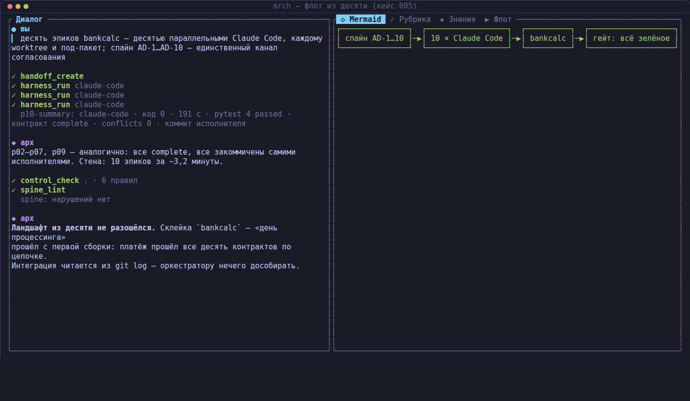
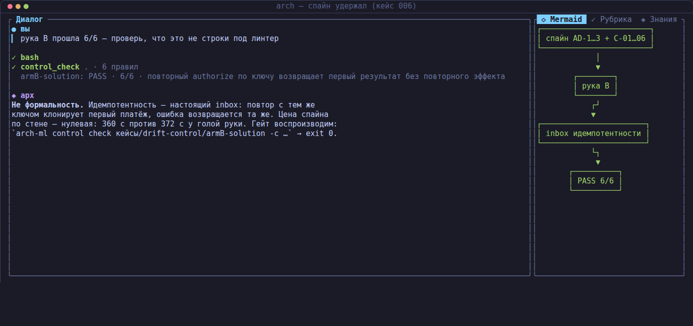
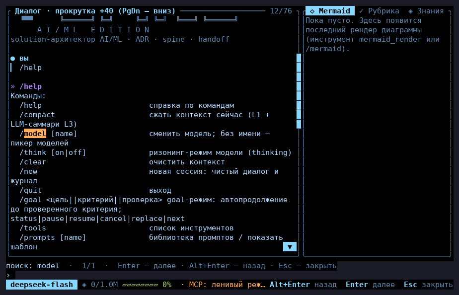
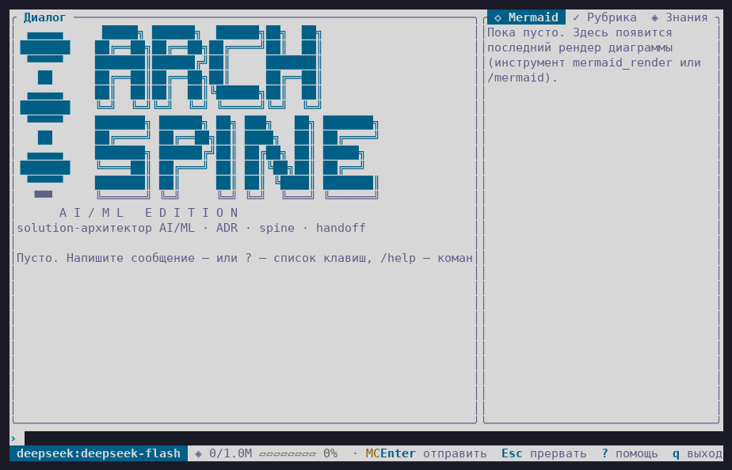
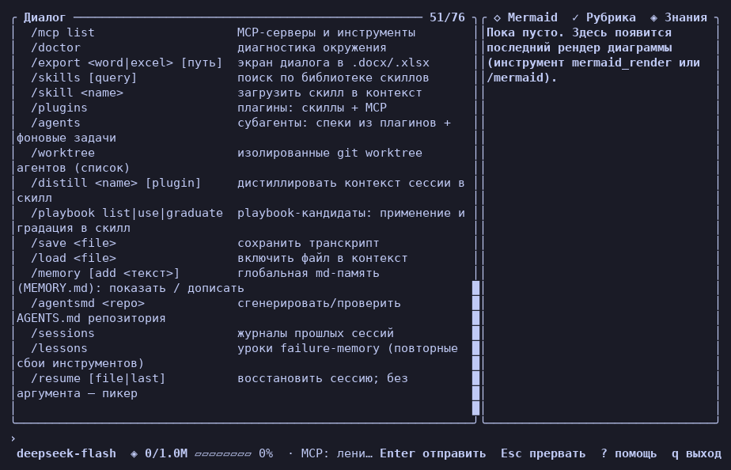

# Spine AI/ML Edition (`arch-ml`)

**🇷🇺 [Русский](#русский)** | **🇬🇧 [English](#english)**

<p align="center">
  
</p>

---

## Русский

**Spine AI/ML Edition** — доменный агентный **метахарнесс** AI/ML-исследователя:
тонкий Rust-инструмент (одна бинарь `arch-ml`: интерактивный TUI + строгий
headless CLI + библиотека), который стоит **над** кодовыми харнессами (Claude
Code, Qwen Code, OpenClaw, Hermes, Theseus, CodeWhale, Kimi Code) и делает из
них управляемых исполнителей: проектирует изменение с инвариантами, передаёт
механический пакет и **проверяет результат исполняемыми гейтами**, а не
на глазок.

Домен: проектирование нейросетей, LLM-графтинг, CPT/SFT/RLHF/RL/RLVR,
дистилляция, steering, агентные приложения.

### Зачем это нужно

Универсальный кодовый харнесс — сильный исполнитель и слабый носитель ваших
стандартов. Три наблюдения, на которых всё стоит:

1. **Модель не угадывает орг-инварианты.** В нашем контролируемом эксперименте
   (`кейсы/drift-control`) одна и та же задача платёжного ядра отдана Claude
   Code дважды: «голая» — дала добротный код (6 модулей, 32 зелёных теста),
   но **нарушила 2 из 6 обязательных правил** (нет `thiserror`, нет
   идемпотентности). Дрейф ровно по орг-специфичным инвариантам — и он
   невидим без механического гейта: тесты зелёные, история чистая.
2. **Проза в промпте — не принуждение.** «Всегда пиши идемпотентно» в
   системном промпте размывается уже на втором ходе. Стандарт, который нельзя
   исполнить командой с exit-кодом, — это пожелание, а не стандарт.
3. **Ревью «на глазок» не аудируемо.** LLM-ревью без привязки к свидетельству
   не воспроизводится и не может быть гейтом в CI.

### Почему доменный харнесс сильнее универсального кодового

| Ось | Универсальный кодовый харнесс | Spine AI/ML Edition |
|---|---|---|
| Знания домена | общий системный промпт | плагины и пресеты домена: `SPINE-ML` (14 инвариантов ML-01…14), 6 плагинов AI/ML (графтинг, пост-тренинг, RL-среды, selfplay) |
| Принуждение к стандартам | инструкции в промпте | детерминированные fitness-правила (`CONSTRAINTS.yaml`, exit-код для CI); доменная волна ML-эксперимента: seed, пины veRL/vLLM, ABI-образ, `gpu_memory_utilization`, KL-регуляризация |
| Оценка качества | ревью «на глазок» | 15 якорных рубрик с LLM-судьёй, привязанным к свидетельству (golden-MAE 0.60), включая `dataset_quality`, `distillation_quality`, `ml_experiment_quality`, `rl_recipe_quality` |
| Подготовка GPU-прогона | learn by burning money | `preflight`: 11 механических гейтов ДО аренды (ABI-матрица, VRAM, чёрный список хостов, потолок бюджета, seed) |
| Память домена | generic RAG | библиотека концептов Ариадна (185 тыс. карточек) + детерминированный роутер экспертов (`v10`/`v1`/`both`/`frontier`) с русскими алиасами |
| Архитектурная целостность | документация задним числом | типизированная модель и трассируемость REQ → NFR → AD → CMP → правило как fitness-функция |
| Передача работы | «сделай X» в чат | handoff-контракт: `TASK.md` + инварианты + fitness-правила + рубрика приёмки + headless JSON-контракт результата (`complete/partial/blocked` + assumptions/open_questions/conflicts) |
| Проверка результата | «готово» исполнителя на веру | механический `control check`: тот же гейт для голой и спайн-руки — воспроизводимо из репозитория |

### Метахарнесс над кодовыми харнессами

```
архитектор в arch-ml ──► спайн инвариантов + ADR + рубрика + скоринг значимости
        │ handoff-пакет (.arch-handoff/: TASK · ARCHITECTURE · CONSTRAINTS · RUBRIC · MANIFEST)
        ▼
кодовый харнесс (Claude Code / Qwen Code / …) исполняет в worktree
        │ headless JSON-контракт результата
        ▼
control check: fitness-гейты механически · evidence bundle · дрейф-контроль
```

Это доказано учебными кейсами в репозитории (воспроизводимы голым бинарём):

- **`кейсы/parallel-epics`** — 3 параллельных Claude Code в 3 worktree, спайн —
  единственный канал согласования: стыки сошлись с первой сборки, 15/15 тестов,
  передача пакета по MCP.
- **`кейсы/fleet-of-ten`** — 10 параллельных исполнителей, ~3,2 мин стены,
  42/42 теста, 60/60 fitness, флот **сам** закоммитил работу 10/10.
- **`кейсы/drift-control`** — A/B-эксперимент дрейфа: голая рука FAIL 2/6,
  рука со спайном PASS 6/6, цена спайна по стене — нулевая.
- **`кейсы/jvm-archunit-gate`** — те же правила из одного `CONSTRAINTS.yaml`
  исполняются и нативно, и настоящим ArchUnit по байткоду Java.

<p align="center">
  
  
</p>

### Что внутри

- **Агентный TUI** (ratatui, Tokyo Night/Day/high-contrast): ярусы цвета
  truecolor → 256 → 16 → монохром, ASCII-фолбэки, справка `?`, поиск по
  диалогу `Ctrl+F`, мышь, заглушка малого окна, индикатор контекстного окна.
- **Строгий headless-контракт**: `arch-ml run -q "…"` — stdout только ответ,
  журналы сессий append-only, экспорт в docx/xlsx.
- **Детерминированный контур контроля**: `control check/score`, типизированная
  модель архитектуры, трассируемость, NFR-бюджеты (latency/доступность/ёмкость/
  стоимость), адаптер OpenSpec, мост ArchUnit, реестр ADR.
- **Рубрики и бенчмарки**: 15 якорных рубрик, архитектурные бенчмарки,
  golden-set судьи, регрессионные eval-сьюты конфигурации.
- **База знаний и веб**: BM25-поиск по локальным базам, кураторские сайты,
  MCP-сервер для кодовых агентов (`spine_lint`, `fitness_check`,
  `significance_score`, `trace_check`, `model_query`, `rubric_run`).
- **Vision-контур** (ADR-041): управление компьютером и браузером через
  нативную мультимодальность (deepseek-flash): скриншот → координаты 0–1000 →
  клик/ввод → контрольный скриншот; CDP-инструменты headless Chrome.
- **Флот**: worktree-фабрика параллельных исполнителей, аудит дублей и
  дрейфа спайна (`fleet audit --stable` — воспроизводимый вывод для CI).
- **Pre-flight ML-эксперимента**, инвентарь GPU (`resources`), provenance
  экспериментов, планировщик задач (`cron`), экспорт отчётов.

<p align="center">
  
  
</p>
<p align="center">
  
  
</p>

### Быстрый старт

```bash
cargo build --release          # бинарь: target/release/arch-ml
ln -sf "$PWD/target/release/arch-ml" ~/.local/bin/arch-ml
arch-ml init                   # конфиг + ассеты в ~/.arch-ml, ~/.config/arch-ml

arch-ml                        # интерактивный TUI
arch-ml run -q "спроектируй скелет MoE-графтинга" > draft.md   # строгий headless
arch-ml doctor                 # диагностика окружения
```

Без-LLM смоук: `arch-ml mermaid examples/mermaid/flow.mmd`,
`arch-ml control score --trigger new_component=true`,
`arch-ml preflight --example`.

Ключи провайдеров — только из окружения (`DEEPSEEK_API_KEY`, `ZHIPU_API_KEY`,
`KIMI_API_KEY`, …), в конфиге не хранятся (AD-3).

### Устройство репозитория

```
src/         ядро: агентный цикл, LLM-транспорт, инструменты, TUI, контроль
assets/      промпты, рубрики, бенчмарки, встроенные плагины
aiml/        доменная зона AI/ML: пресет ml-researcher (SPINE-ML), 6 плагинов,
             fitness-волна wave1, демо steering, рабочие заметки
кейсы/       учебные кейсы цикла (воспроизводятся голым бинарём, см. реестр
             в кейсы/AGENTS.md)
docs/        гайды (TUI, MCP, headless, интеграции), ADR-001…043
benchmarks/  A/B-бенчмарки с пререгистрацией
sdk/, examples/, deploy-kit/, scripts/
```

### Происхождение и лицензия

Линия: **Spine** (MIT) → **Spine Banking Edition** (ядро MIT + proprietary
зона `banking/`) → **Spine AI/ML Edition** (этот репозиторий). Проприетарная
банковская зона в публикацию **не входит** и остаётся в приватном
репозитории владельца; здесь — MIT (`LICENSE`), см. `NOTICE.md`.

Исследовательский прототип: кейсы синтетические, учебные — не промышленные
дизайны.

---

## English

**Spine AI/ML Edition** is a domain agent **meta-harness** for AI/ML
researchers: a thin Rust tool (one binary, `arch-ml`: interactive TUI +
strict headless CLI + library) that stands **above** coding harnesses
(Claude Code, Qwen Code, OpenClaw, Hermes, Theseus, CodeWhale, Kimi Code)
and turns them into managed executors: it designs the change with
invariants, hands over a mechanical package, and **verifies the result with
executable gates** instead of eyeballing it.

Domain: neural-net design, LLM grafting, CPT/SFT/RLHF/RL/RLVR, distillation,
steering, agentic applications.

### Why

A universal coding harness is a strong executor and a weak carrier of your
standards. Three observations this project stands on:

1. **A model cannot guess your org invariants.** In our controlled
   experiment (`кейсы/drift-control`) the same payment-core task was given to
   Claude Code twice: the bare run produced solid code (6 modules, 32 green
   tests) yet **violated 2 of 6 mandatory rules** (no `thiserror`, no
   idempotency). The drift was exactly along org-specific invariants —
   invisible without a mechanical gate.
2. **Prose in a prompt is not enforcement.** "Always write idempotent code"
   in a system prompt dilutes by the second turn. A standard you cannot run
   as a command with an exit code is a wish, not a standard.
3. **Eyeball reviews are not auditable.** An LLM review without evidence
   binding cannot be reproduced and cannot gate CI.

### Why a domain harness beats universal coding harnesses

| Axis | Universal coding harness | Spine AI/ML Edition |
|---|---|---|
| Domain knowledge | generic system prompt | domain plugins & presets: `SPINE-ML` (14 invariants ML-01…14), 6 AI/ML plugins (grafting, post-training, RL environments, selfplay) |
| Standard enforcement | prompt instructions | deterministic fitness rules (`CONSTRAINTS.yaml`, CI exit codes); ML-experiment wave: seeds, veRL/vLLM pins, ABI image, `gpu_memory_utilization`, KL regularization |
| Quality evaluation | eyeball review | 15 anchored rubrics with an evidence-bound LLM judge (golden MAE 0.60): `dataset_quality`, `distillation_quality`, `ml_experiment_quality`, `rl_recipe_quality`, … |
| GPU run preparation | learn by burning money | `preflight`: 11 mechanical gates BEFORE renting (ABI matrix, VRAM, host blacklist, budget cap, seed) |
| Domain memory | generic RAG | Ariadna concept library (185k cards) + deterministic expert router (`v10`/`v1`/`both`/`frontier`) with Russian aliases |
| Architecture integrity | docs after the fact | typed model and traceability REQ → NFR → AD → CMP → rule as a fitness function |
| Delegation | "do X" in chat | handoff contract: `TASK.md` + invariants + fitness rules + acceptance rubric + headless JSON result contract (`complete/partial/blocked` + assumptions/open_questions/conflicts) |
| Result verification | trust the executor's "done" | mechanical `control check`: same gate for both arms — reproducible from the repo |

### The meta-harness

```
architect in arch-ml ──► spine invariants + ADRs + rubric + significance scoring
        │ handoff package (.arch-handoff/: TASK · ARCHITECTURE · CONSTRAINTS · RUBRIC · MANIFEST)
        ▼
coding harness (Claude Code / Qwen Code / …) executes in a worktree
        │ headless JSON result contract
        ▼
control check: mechanical fitness gates · evidence bundle · drift control
```

Proven by the educational cases in this repo (reproducible with the bare
binary):

- **`кейсы/parallel-epics`** — 3 parallel Claude Code instances in 3
  worktrees, the spine as the only coordination channel: joints fit on the
  first build, 15/15 tests, package handed over via MCP.
- **`кейсы/fleet-of-ten`** — 10 parallel executors, ~3.2 min wall clock,
  42/42 tests, 60/60 fitness rules, and the fleet **committed its own work**
  10/10.
- **`кейсы/drift-control`** — drift A/B experiment: bare arm FAIL 2/6, spine
  arm PASS 6/6, zero wall-clock cost of the spine.
- **`кейсы/jvm-archunit-gate`** — one `CONSTRAINTS.yaml` executed both
  natively and by real ArchUnit against Java bytecode.

### What's inside

- **Agent TUI** (ratatui, Tokyo Night/Day/high-contrast): color tiers
  truecolor → 256 → 16 → mono, ASCII fallbacks, `?` help overlay, dialog
  search `Ctrl+F`, mouse, small-terminal stub, live context-window gauge.
- **Strict headless contract**: `arch-ml run -q "…"` — stdout is the final
  answer only; append-only session journals; docx/xlsx export.
- **Deterministic control layer**: `control check/score`, typed architecture
  model, traceability, NFR budgets (latency/availability/capacity/cost),
  OpenSpec adapter, ArchUnit bridge, ADR registry.
- **Rubrics & benchmarks**: 15 anchored rubrics, architecture benchmarks,
  judge golden set, continuous eval suites.
- **Knowledge & web**: BM25 over local knowledge bases, curated sites,
  MCP server for coding agents (`spine_lint`, `fitness_check`,
  `significance_score`, `trace_check`, `model_query`, `rubric_run`).
- **Vision contour** (ADR-041): computer & browser control via native
  multimodality (deepseek-flash): screenshot → normalized 0–1000
  coordinates → click/type → verification screenshot; headless Chrome CDP
  tools.
- **Fleet**: worktree factory for parallel executors, SSOT audit of spine
  copies (`fleet audit --stable` — CI-reproducible output).
- **ML experiment pre-flight**, GPU inventory (`resources`), experiment
  provenance, `cron` scheduler, report export.

### Quick start

```bash
cargo build --release          # binary: target/release/arch-ml
ln -sf "$PWD/target/release/arch-ml" ~/.local/bin/arch-ml
arch-ml init                   # config + assets into ~/.arch-ml, ~/.config/arch-ml

arch-ml                        # interactive TUI
arch-ml run -q "design an MoE grafting skeleton" > draft.md   # strict headless
arch-ml doctor                 # environment check
```

No-LLM smoke: `arch-ml mermaid examples/mermaid/flow.mmd`,
`arch-ml control score --trigger new_component=true`,
`arch-ml preflight --example`.

Provider keys come from the environment only (`DEEPSEEK_API_KEY`,
`ZHIPU_API_KEY`, `KIMI_API_KEY`, …) — never stored in the config (AD-3).

### Repository layout

```
src/         core: agent loop, LLM transport, tools, TUI, control layer
assets/      prompts, rubrics, benchmarks, built-in plugins
aiml/        AI/ML domain zone: ml-researcher preset (SPINE-ML), 6 plugins,
             wave1 fitness rules, steering demo, design notes
кейсы/       educational end-to-end cases (reproducible, see кейсы/AGENTS.md)
docs/        guides (TUI, MCP, headless, integrations), ADR-001…043
benchmarks/  preregistered A/B benchmarks
sdk/, examples/, deploy-kit/, scripts/
```

### Origin and license

Lineage: **Spine** (MIT) → **Spine Banking Edition** (MIT core + proprietary
`banking/` zone) → **Spine AI/ML Edition** (this repository). The
proprietary banking zone is **not included** and stays in the owner's
private repository; everything here is MIT (`LICENSE`), see `NOTICE.md`.

Research prototype: cases are synthetic and educational — not production
designs.
