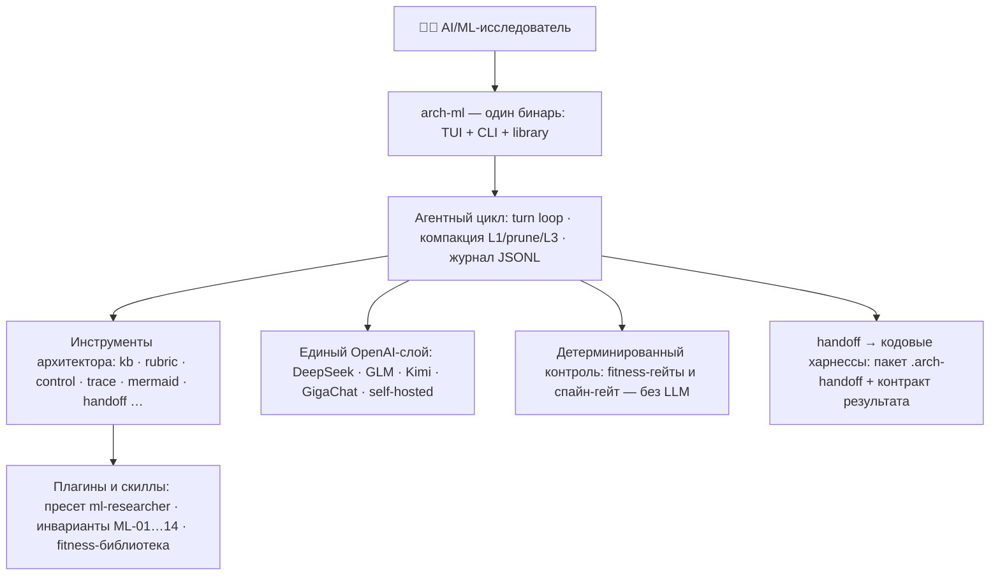

<p align="center">
  
</p>

<p align="center">
  <b>Доменный метахарнесс AI/ML-исследователя поверх кодовых харнессов</b><br>
  <sub>spine-инварианты · ADR · fitness-гейты · рубрики с LLM-судьёй · handoff кодовым харнессам · флоты субагентов<br>
  A domain meta-harness for AI/ML researchers — one Rust binary: TUI + CLI + library.</sub>
</p>

<p align="center">
  <a href="https://github.com/romannekrasovaillm/spine-aiml/actions/workflows/ci.yml"></a>
  <a href="https://github.com/romannekrasovaillm/spine-aiml/releases"></a>
  
  
  
</p>

<p align="center">
  <b>🇷🇺 Русский</b> · <b>🇬🇧 <a href="README.en.md">English</a></b> · <b>🧪 <a href="#кейсы">Кейсы</a></b> · <b>✨ <a href="docs/features.md">Все возможности</a></b> · <b>📦 <a href="docs/handoff_walkthrough.md">Handoff walkthrough</a></b> · <b>📜 <a href="CHANGELOG.md">Changelog</a></b>
</p>

---

<p align="center">
  
</p>

## ⚡ Попробовать за 5 минут

```bash
cargo build --release          # бинарь: target/release/arch-ml
ln -sf "$PWD/target/release/arch-ml" ~/.local/bin/arch-ml   # запуск одним словом
arch-ml init                   # конфиг + ассеты в ~/.arch-ml и ~/.config/arch-ml/
```

Готовый бинарь — в [GitHub Releases](https://github.com/romannekrasovaillm/spine-aiml/releases)
(`arch-ml-linux-x86_64` + SHA256SUMS + SBOM). Дальше — **без API-ключей и
сети** (детерминированный слой, AD-2):

```bash
arch-ml doctor                                # 11 проверок окружения
cd examples/ml-experiment
arch-ml control check . --constraints CONSTRAINTS.yaml   # FAIL: нет seed/манифеста/бюджета
cp fix/train.py train.py && cp fix/run-manifest.yaml run-manifest.yaml
arch-ml control check . --constraints CONSTRAINTS.yaml   # PASS — так выглядит гейт ML-06/ML-09
arch-ml mermaid ../mermaid/ml-pipeline.mmd    # диаграмма → ASCII в терминале
arch-ml control score --trigger new_component=true       # маршрут значимости
```

С ключом любого OpenAI-совместимого провайдера (`DEEPSEEK_API_KEY`,
`ZHIPU_API_KEY`, `KIMI_API_KEY`, …) открывается агентный слой:

```bash
arch-ml                                        # интерактивный TUI
arch-ml run -q "собери ADR по выбору между LoRA и полным файнтюном" > adr.md
```

Подробная установка — [docs/getting_started.md](docs/getting_started.md).

## Что это

**Spine AI/ML Edition** — тонкий агентный харнесс, который стоит *над*
кодовыми харнессами (Claude Code, Kimi Code, Qwen Code, Theseus и др.) и ведёт
ML-исследование как инженерную дисциплину, а не как цепочку ноутбуков.
Четыре опоры:

1. **Доменный пресет `ml-researcher`** (`aiml/presets/ml-researcher/`) —
   модельная матрица из трёх уровней с маршрутизацией по чувствительности
   данных (приватный вход — только локальным моделям, ML-02).
2. **Инварианты контура ML-01…ML-14** (`SPINE-ML.md`) — исполняемые
   fitness-правила, а не проза: приватный периметр весов и датасетов,
   воспроизводимость прогона (конфиг + версии + seed в манифесте),
   провенанс датасета, бюджет с потолком стоимости, честный отчёт
   «измеренное vs предположенное».
3. **8 доменных плагинов** (`aiml/plugins/`): проектирование сетей,
   LLM-графтинг, continual learning, RL-среды, selfplay-контракты,
   лесенка маленьких моделей на GB10/DGX Spark, роутинг гипотез.
4. **Память о намерении** (`HYPOTHESIS.md`, ADR-047): карточка гипотезы
   всплывает по фактам проекта сама, без поиска.

Харнесс намеренно тонкий: тяжёлая часть — не код, а дисциплина артефактов
(спайн-инварианты с `Binds`/`Prevents`/`Rule`, ADR до реализации, evidence
с цитатами, машинно-проверяемые fitness-функции). Источники идей —
`docs/SOURCE_BRIEF.md`. Форк банковской линии Spine — `NOTICE.md`; ядро —
MIT.

## 🧪 Кейсы — сквозные прогоны, а не обещания

Каждый кейс — самодостаточный пример работы с харнессом: от
spine-инвариантов до пакета передачи кодовому харнессу. Реестр и
конвенции — [`кейсы/AGENTS.md`](кейсы/AGENTS.md).

| Кейс | Модель | Что показывает |
|------|--------|----------------|
| [laguna-compact](кейсы/laguna-compact/) | Qwen2.5 (GB10) | RL-лесенка CPT→SFT→RL на одной GPU-карте: стражи ресурса, ревизии корпуса, пилот с одним сидом |
| [kimi-killer](кейсы/kimi-killer/) | — (претрейн) | Состязание длинноконтекстных архитектур: единый контракт прогона, механический вердикт, приватный корпус не покидает контур |
| [drift-control](кейсы/drift-control/) | Claude Code (A/B) | Голая задача → гейт FAIL 2/6; та же задача + handoff-пакет → PASS 6/6 |
| [parallel-epics](кейсы/parallel-epics/) | Claude Code ×3 | Параллельный флот по worktree: стыки сошлись с первой сборки (15/15 тестов) |
| [fleet-of-ten](кейсы/fleet-of-ten/) | Claude Code ×10 | Десять эпиков за ~3,2 мин стены: 10/10 complete, флот **сам** закоммитил работу |
| [fleet-spine-drift](кейсы/fleet-spine-drift/) | — (механический) | Аудит флота: дубли 66.7% и дрейф `CONSTRAINTS.yaml` как exit-код |
| [fleet-patterns](кейсы/fleet-patterns/) | — (механический) | Движок оркестрации флотов: fanout / pipeline / map_reduce / tournament / dag |
| [legacy-survey](кейсы/legacy-survey/) | — (механический) | Reverse discovery legacy-монолита: скрытые связи с `[confirmed]` и честные `[gap]` |
| [jvm-archunit-gate](кейсы/jvm-archunit-gate/) | — (механический) | Один `CONSTRAINTS.yaml` — два исполнителя: нативный гейт и настоящий ArchUnit по байткоду |
| [sbp-gateway](кейсы/sbp-gateway/) | DeepSeek V4 Flash | Полный цикл: spine → solutioning → ADR → контракты/NFR → handoff кодовому харнессу |
| [payment-processing-platform](кейсы/payment-processing-platform/) | GLM-5.2 | Greenfield маршрута Critical за одну сессию: 27 инвариантов, 16 ADR |
| [govproc-platform](кейсы/govproc-platform/) | Kimi K3 | Компактный комплект: 7 AD, 5 ADR, OpenAPI-контракт как первоклассный артефакт |

### 🏗 Архитектура за 10 секунд



## Ключевые возможности

Полный обзор (RU + EN, с разбором каждого механизма) — [docs/features.md](docs/features.md).

- **Модели и ризонинг**: DeepSeek V4/V4.1, GLM-5.3/5.2 (окно 1M), Kimi K3,
  любой OpenAI-совместимый endpoint; переключатель `/think on|off|auto`,
  зрение (`screenshot`/`read_image`), управление компьютером и браузером
  (класс `Destructive`, выключено по умолчанию).
- **Библиотека скиллов**: 9 встроенных плагинов (61 скилл) + 8 доменных
  AI/ML-плагинов; `arch-ml skills search/show`, дистилляция статей в скиллы.
- **Флоты исполнителей**: фоновые субагенты, ralph-циклы, worktree-фабрика,
  оркестрация по паттернам (ADR-042) с механическими гейтами узлов.
- **Губернанс**: уровни автономии R0–R5, Evidence Bundle как гейт выпуска,
  метрики (включая approval-theater детектор и hit-rate KV-кэша по моделям
  и сессиям), дельта-спеки OpenSpec.
- **Архитектурный контроль без LLM**: `control check` (fitness),
  `control score` (маршрут значимости с anti-bypass по git-диффу),
  `trace check`, `nfr budget/availability/capacity/cost`, ArchUnit-мост
  для JVM, корпоративный спайн с наследованием правил.
- **Модель архитектуры**: типизированные сущности (CAP/SYS/CMP/INT/NFR/ADR…),
  ссылочная целостность, экспорт в Structurizr/PlantUML/drawio, ArchiMate.
- **Handoff кодовым харнессам**: пакет `.arch-handoff/` с контрактом
  результата, умные таймауты, репетиция отката на гейте A4, авто-коммит;
  транспорт process или ACP (Agent Client Protocol, ADR-049) с живой
  проекцией tool/plan/usage и закреплением сессии по алиасу.
- **MCP-сервер** `arch-ml mcp serve`: 34 инструмента архитектурного
  контроля наружу кодовым агентам — verdict в момент написания кода.
- **SDK**: тонкие клиенты Python/Rust/Java поверх headless CLI
  (`sdk/CONTRACT.md`).
- **TUI**: Tokyo Night, mermaid-арт на боковой вкладке, выделение мышью с
  автокопированием, очередь сообщений, прерывание хода, экспорт в Word/Excel,
  индикатор «· кэш NN%» в статус-баре и версия сборки на стартовом сплэше.

### Пример: mermaid → ASCII в терминале

`arch-ml mermaid examples/mermaid/ml-pipeline.mmd`:

```
           ┌──────────────────────┐
           │ Корпус концептов v12 │
           └──────────────────────┘
         └─────────────┤
                       ▼
          ┌────────────────────────┐
          │ CPT: доменный претрейн │
          └────────────────────────┘
                       │
                       ▼
         ┌──────────────────────────┐
         │ SFT: инструкции и формат │
         └──────────────────────────┘
                       │
                       ▼
     ┌──────────────────────────────────┐
     │ RL: GRPO, функциональная награда │
     └──────────────────────────────────┘
                       │
                       ▼
         ┌──────────────────────────┐
         │ Eval: pass@k + LLM-судья │
         └──────────────────────────┘
         ┌ниже─порога──┴──────────┐
         ▼                        ▼ выше порога
┌─────────────────┐   ┌───────────────────────┐
│ Ревизия корпуса │   │ GGUF-экспорт и деплой │
└─────────────────┘   └───────────────────────┘
```

## CLI

```
arch-ml [--config <path>] <command>   # без команды — TUI
```

| Команда | Назначение |
|---|---|
| `run [prompt] [-q] [--model] [--timeout] [--max-turns]` | Headless-прогон агента со строгим контрактом stdout |
| `control check / score / spine / sensors` | Fitness-гейты и маршрут значимости (без LLM) |
| `mermaid <file>` · `archify validate/deliver/compare` | Диаграммы: ASCII в терминал и контур JSON IR → HTML с SHA-256 receipt |
| `rubric run` · `bench run --golden` | Рубрики с LLM-судьёй; калибровка судьи по golden-set |
| `eval run [--gate]` | Регрессионные eval-сьюты конфигурации (гоняются в CI) |
| `model validate/graph/export` · `trace check` · `nfr …` | Типизированная модель архитектуры, трассировка, количественные NFR |
| `handoff` · `harness-run` · `worktree …` · `fleet …` | Передача работы кодовым харнессам, изоляция, флоты |
| `weights list/verify` · `data-card check` · `trajectory metrics` | Реестр весов/датасетов и eval-метрики (ADR-044) |
| `agents-md refresh/lint` · `survey` · `delta …` · `openspec …` | AGENTS.md для репозиториев, reverse discovery, дельта-спеки |
| `doctor` · `metrics` · `evidence pack/verify` | Диагностика, KPI, аудиторский след |

Полная таблица команд — в [docs/features.md](docs/features.md#cli) и
`docs/tools.md` (инструменты агента).

## Настройка персональных путей

Вся привязка к машине — только в конфиге (в коде нейтральные
плейсхолдеры). Порядок поиска: `--config <path>` → `./arch-ml.toml` →
`~/.config/arch-ml/config.toml` → встроенные дефолты. Все секции
опциональны.

```toml
# ~/.config/arch-ml/config.toml
[knowledge]
dirs = ["~/Документы/архитектура", "~/library"]   # база знаний (kb_search)

[plugins]
dirs = ["~/.arch-ml/plugins", "~/my-plugins"]     # библиотеки плагинов

[paths]
sessions_dir = "~/.arch-ml/sessions"              # журналы сессий
```

API-ключи: `api_key_env` (имя env-переменной) или `api_key_file` (путь к
файлу) — значения ключей в конфиг не пишутся никогда. Полный образец с
комментариями — `config.example.toml`.

## Документация

- [docs/getting_started.md](docs/getting_started.md) — установка подробно;
  [docs/features.md](docs/features.md) — все возможности (RU/EN);
  [README.en.md](README.en.md) — английская версия.
- [docs/architecture.md](docs/architecture.md) — устройство и контракты;
  `AGENTS.md` — для агентов и контрибьюторов; `AGENTS-READERS.md` — карта
  идей за 5 минут для читателей.
- [ROADMAP.md](ROADMAP.md) — куда идём; [CHANGELOG.md](CHANGELOG.md) — что
  изменилось; [CONTRIBUTING.md](CONTRIBUTING.md) — как внести вклад;
  `docs/adr/` — 46+ решений и их обоснования.
- Тесты: `cargo test`; CI: fmt / clippy `-D warnings` / test / MSRV 1.85 /
  audit / dogfood / eval-suite + тесты SDK — `.github/workflows/ci.yml`.

## Форк и лицензия

Spine AI/ML Edition — чистый форк банковской линии Spine (2026-09-11,
`NOTICE.md`), домен переопределён под AI/ML-исследования. Ядро — MIT
(`LICENSE`). Вопросы — [Issues](https://github.com/romannekrasovaillm/spine-aiml/issues)
(`SUPPORT.md`), уязвимости — `SECURITY.md`.
