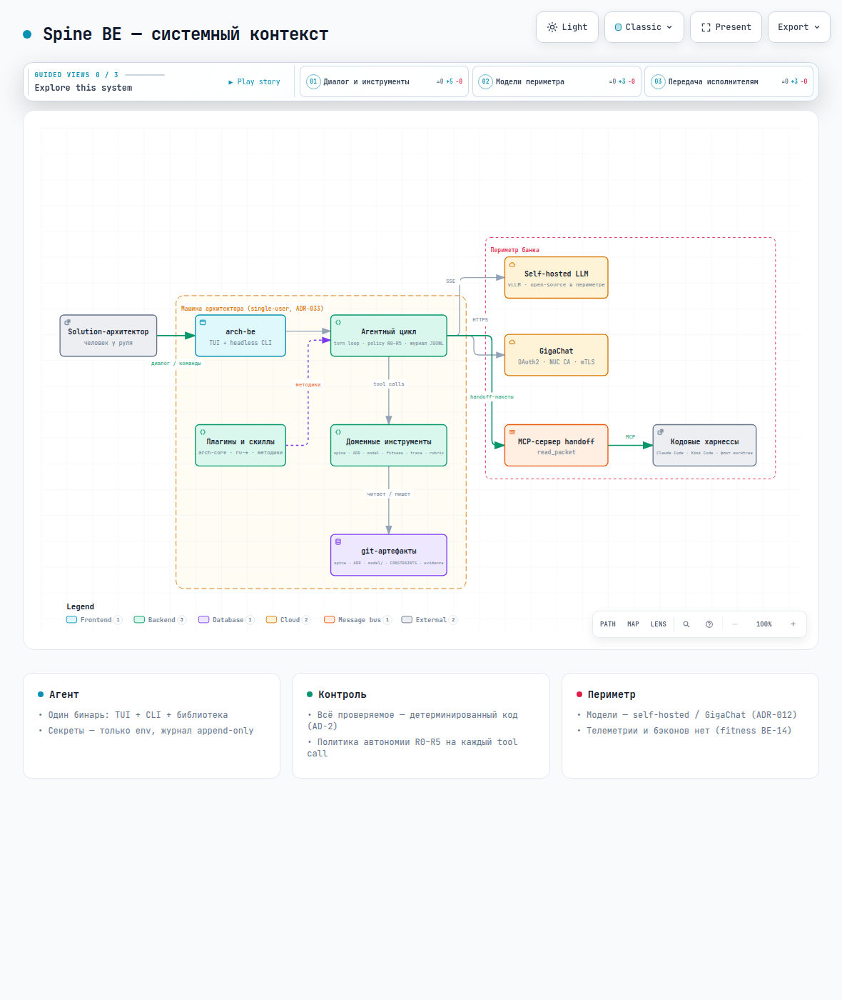
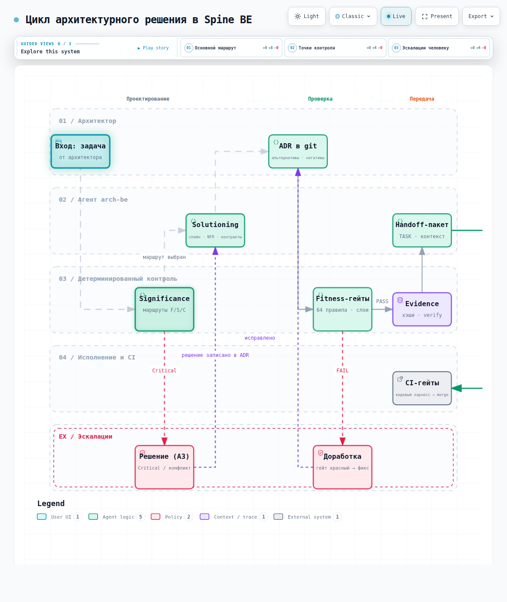
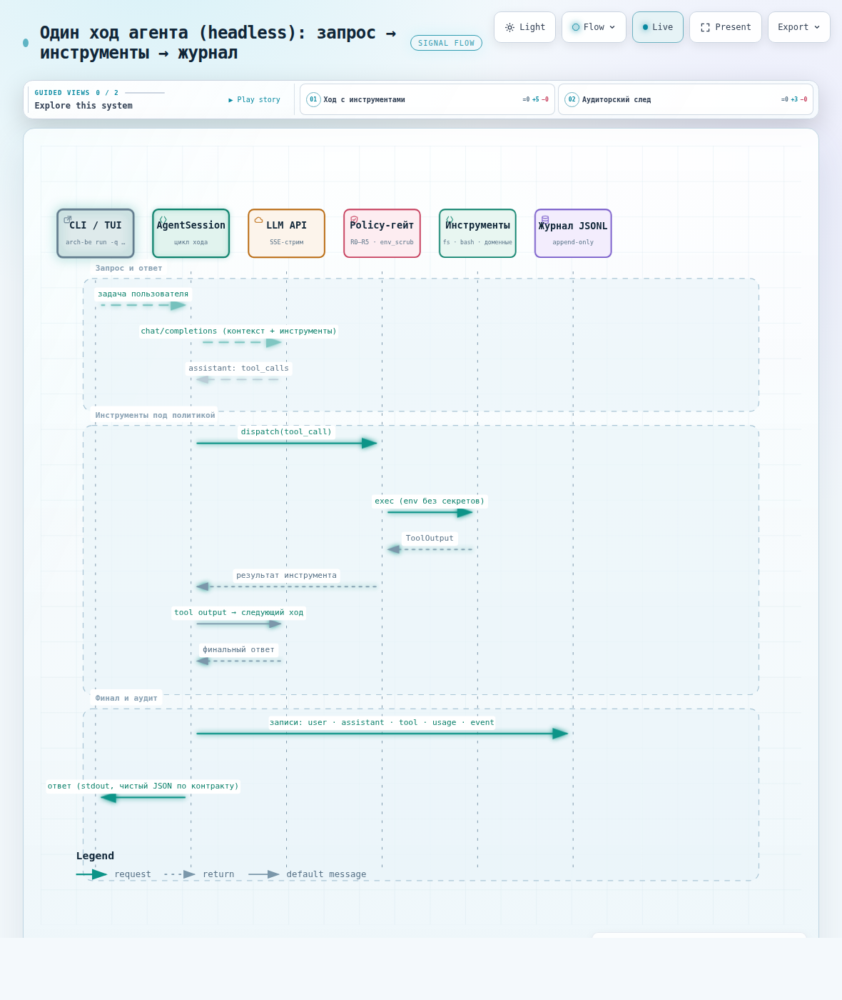
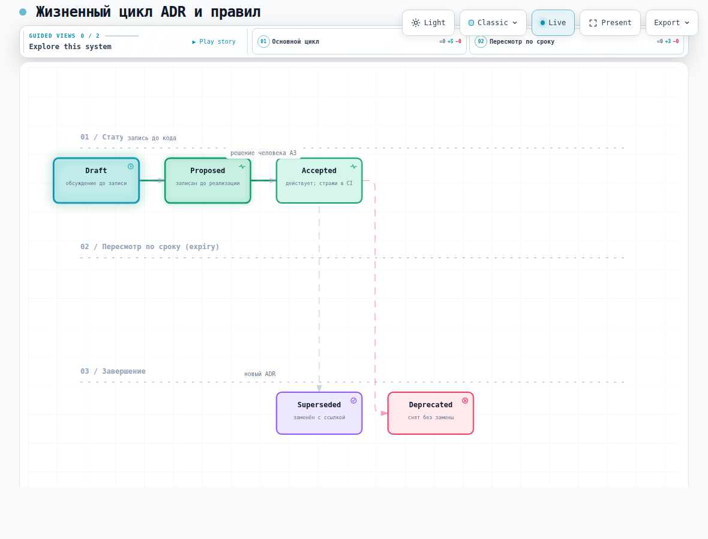
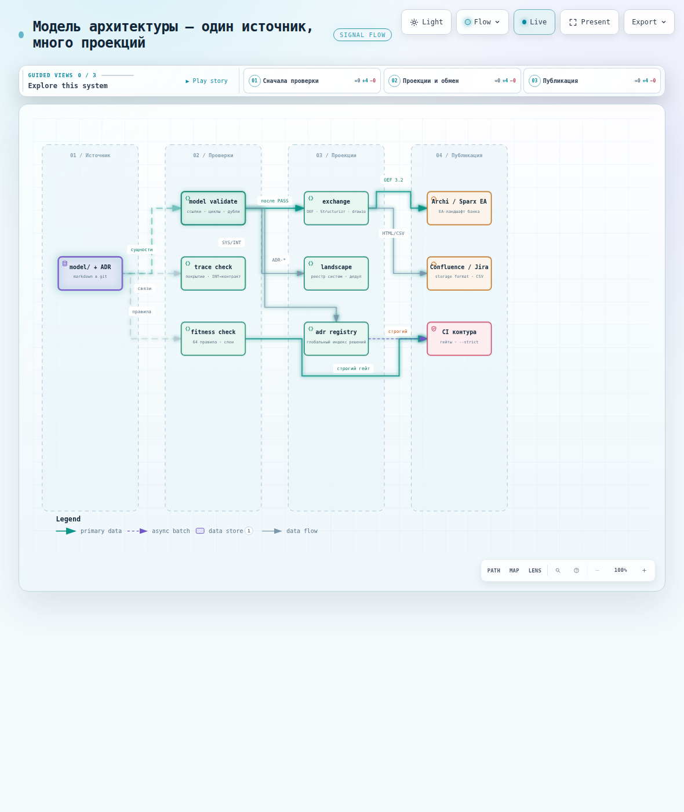
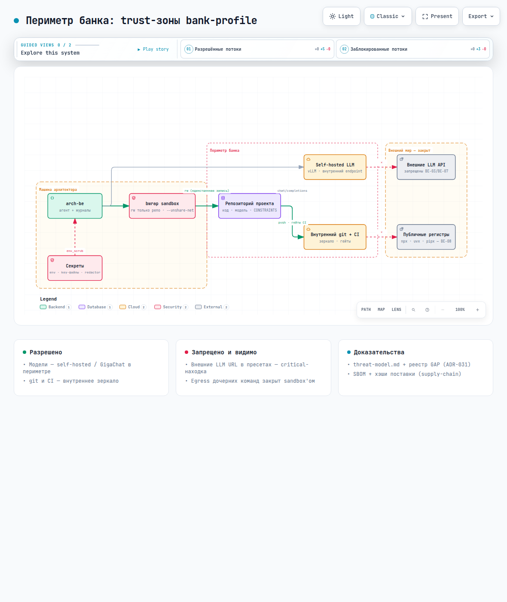

# Spine AI/ML Edition — дружелюбный гид

Добро пожаловать! Это документ для тех, кто видит Spine AI/ML Edition
впервые: за 15 минут чтения вы поймёте, что это за продукт, как он устроен
и как им пользоваться каждый день. Без занудства — с картинками, которые
сгенерированы самим продуктом (контур Archify, ADR-027: диаграмма как
верифицируемый артефакт, а не картинка из PowerPoint).

> Каждая диаграмма здесь — живой артефакт: PNG — превью, по ссылке рядом
> интерактивный HTML (guided views, анимация маршрутов), а исходник —
> типизированный JSON IR в git (`docs/diagrams/guide/`).

## 1. Что это такое

**Spine AI/ML Edition** — доменный метахарнесс AI/ML-исследователя. Одна
программа (`arch-ml`), которая помогает проектировать: ведёт диалог,
пишет ADR и инварианты, проверяет их машиной, собирает доказательства и
передаёт работу кодовым харнессам. Всё состояние — обычные файлы в git:
ни базы, ни сервера, ни учёток (это принцип, см. ADR-033).

Главная идея: **решения архитектора должны быть исполняемыми**, а не
прозой в вики. Инвариант «ошибки — через thiserror» превращается в
правило CONSTRAINTS, которое ломает сборку при нарушении. Решение
о слоях — в структурную fitness-функцию. Требование свежести отчёта об
учениях — в `max_age`-гейт.


*[интерактивная версия](diagrams/guide/01-system-context.html) · [исходник IR](diagrams/guide/01-system-context.architecture.json)*

## 2. Быстрый старт (5 минут)

```bash
cargo build --release
ln -sf "$PWD/target/release/arch-ml" ~/.local/bin/arch-ml
arch-ml init        # конфиг и ассеты в ~/.arch-ml
arch-ml doctor      # 11 проверок окружения
arch-ml             # интерактивный TUI — поговорите с ним
```

Без ключей и сети тоже есть что показать:

```bash
arch-ml mermaid examples/mermaid/flow.mmd        # ASCII-арт диаграммы
arch-ml control score --trigger new_component=true   # маршрут значимости
arch-ml control check . --constraints CONSTRAINTS.yaml  # 70+ гейтов, PASS
arch-ml survey кейсы/legacy-survey/monolith      # карта legacy за секунды
```

## 3. День архитектора: как выглядит рабочий цикл

От входа до передачи исполнителям — один проваленный гейт не доводит
работу до merge, а критическое всегда останавливается на человеке (A3):


*[интерактивная версия](diagrams/guide/02-decision-workflow.html) · [исходник IR](diagrams/guide/02-decision-workflow.workflow.json)*

1. **Значимость**: `arch-ml control score` (а лучше `--from-diff` —
   маршрут вычисляется ещё и по факту изменений, заявить «Fast» мимо
   детекторов не выйдет — ADR-034).
2. **Проектирование**: агент со скиллами библиотеки (плагины ru-*,
   arch-core) готовит спайн, NFR, контракты.
3. **Решение**: ADR с альтернативами, честными минусами и обратимостью
   (рубрика `adr_quality` следит за формой).
4. **Проверка**: fitness + trace — 86 правил, включая структурные:
   слои (`dependency_direction`, ADR-029) и границы контекстов
   (`context_boundary`, ADR-030); на JVM-проектах те же java-правила
   исполняются настоящим ArchUnit (тип правила `archunit` и команды
   `arch-ml archunit gen|check|fetch`, ADR-039, `docs/archunit.md`).
5. **Доказательства**: evidence bundle с хэшами — «спека задним числом»
   не проходит `evidence verify`.
6. **Передача**: handoff-пакет кодовому харнессу по MCP — контекст
   доезжает дословно, а не пересказом.

## 4. Под капотом: один ход агента

Что происходит между вашим вопросом и ответом — каждый вызов
инструмента проходит policy-гейт, каждое событие пишется в журнал:


*[интерактивная версия](diagrams/guide/03-agent-turn.html) · [исходник IR](diagrams/guide/03-agent-turn.sequence.json)*

Три детали, которые приятно знать:

- **Секреты не покидают процесс**: дочерние команды получают
  почищенное окружение (`env_scrub`), вывод инструментов проходит
  redactor.
- **Деструктив запрещён по умолчанию**: `rm -rf` — deny на уровне R2;
  в headless «подтвердить» невозможно — агент корректно останавливается.
- **Журнал — единственный источник аудита** (AD-5): user, assistant,
  tool, usage, event — append-only JSONL, из него же считаются метрики.

## 5. Артефакты и их жизненный цикл

ADR не «написан и забыт»: у него статусная машина, а у временных
решений — срок годности (просрочка — механическая warn-находка):


*[интерактивная версия](diagrams/guide/05-adr-lifecycle.html) · [исходник IR](diagrams/guide/05-adr-lifecycle.lifecycle.json)*

Та же дисциплина у fitness-правил: карточка с владельцем и `expiry`
(ADR-019), инвентарь — `arch-ml control rules-report`.

## 6. Одна модель — много проекций

Модель архитектуры (`model/`, ADR-003) — единственный источник истины;
всё остальное — проверяемые проекции:


*[интерактивная версия](diagrams/guide/04-model-projections.html) · [исходник IR](diagrams/guide/04-model-projections.dataflow.json)*

- **Обмен с отраслью**: `arch-ml model export --format archimate`
  (открывается в Archi/Sparx, ADR-032), Structurizr/PlantUML/drawio
  с точным round-trip (ADR-009).
- **Реестры без сервисов**: `arch-ml model landscape` (системы всех
  проектов с дедупом, ADR-037) и `arch-ml adr registry` (глобальный
  индекс решений, ADR-036).
- **Публикация**: `arch-ml publish confluence` / `publish jira` —
  файловые адаптеры, живых коннекторов нет (ADR-033).

## 7. Периметр и безопасность

Периметр исследователя описывается пресетом `aiml/presets/ml-researcher/`
(инварианты ML-01…ML-14) и моделью угроз (`docs/threat-model.md`, ADR-031).
Диаграмма ниже — из родительской редакции (корпоративный контур); топология
trust-зон у ML-профиля та же:


*[интерактивная версия](diagrams/guide/06-perimeter.html) · [исходник IR](diagrams/guide/06-perimeter.architecture.json)*

- Приватные данные и веса — только внутри периметра: приватный вход
  маршрутизируется на локальные модели (ML-02), утечки в промпты/логи/трассы
  запрещены (ML-03), публикации обезличиваются (ML-13).
- `[bash] sandbox = "bwrap"` — команды агента без сети, запись только в
  репозиторий; нет bwrap — fail-closed (ADR-038).
- Изоляция недоверенного кода — ML-14; веса и датасеты — симлинками из
  канонического хранилища, копии запрещены (C-032/C-033 кейсов).
- Поставка проверяема: SBOM (CycloneDX), хэши, сборка из исходников —
  `docs/supply-chain.md`.

## 8. Шпаргалка команд

| Команда | Что делает |
|---|---|
| `arch-ml` / `arch-ml run -q "…"` | TUI / строгий headless с JSON-контрактом |
| `arch-ml control check <repo>` | fitness-гейты (10 типов правил), per-rule timing |
| `arch-ml archunit gen / check / fetch` | ArchUnit-мост (ADR-039): JVM-гейты из CONSTRAINTS.yaml настоящим ArchUnit |
| `arch-ml control rules-report` | инвентарь правил: владельцы, expiry, исключения |
| `arch-ml control score [--from-diff]` | маршрут значимости + anti-bypass |
| `arch-ml model validate / graph / export / landscape` | модель: проверки, диаграммы, обмен, ландшафт |
| `arch-ml adr registry <root>` | глобальный реестр ADR по проектам |
| `arch-ml trace check <case>` | позвенная трассировка REQ → … → правило |
| `arch-ml survey <repo>` | reverse discovery: карта системы с confirmed/gaps |
| `arch-ml bench run --golden [--record]` | калибровка судьи: MAE + length bias ρ |
| `arch-ml publish confluence/jira` | файловые адаптеры публикации |
| `arch-ml doctor` | диагностика окружения |

## 9. FAQ

- **Это заменит архитектора?** Нет. Машина проверяет, человек решает:
  гейты A0–A5, `decision_a3`, дрейф-эксперимент (кейс 006) показывает
  цену отсутствия пакета.
- **Можно без LLM?** Да: все гейты, модель, survey, обмен и публикация —
  детерминированный код (AD-2), работают офлайн.
- **Как посмотреть «в работе»?** Кейсы `кейсы/` — воспроизводимые:
  от walking skeleton СБП-шлюза до флота из десяти исполнителей и
  обследования legacy-монолита (кейс 008).
- **Куда сообщать о проблемах?** `SUPPORT.md`; уязвимости — `SECURITY.md`.

## 10. Куда идти дальше

- `docs/getting_started.md` — установка подробно;
- `docs/control.md` — все типы fitness-правил и схемы;
- `docs/architecture.md` — карта кода по модулям;
- `docs/adr/` — 46+ решений: почему всё устроено именно так;
- `ROADMAP.md` — что дальше.
