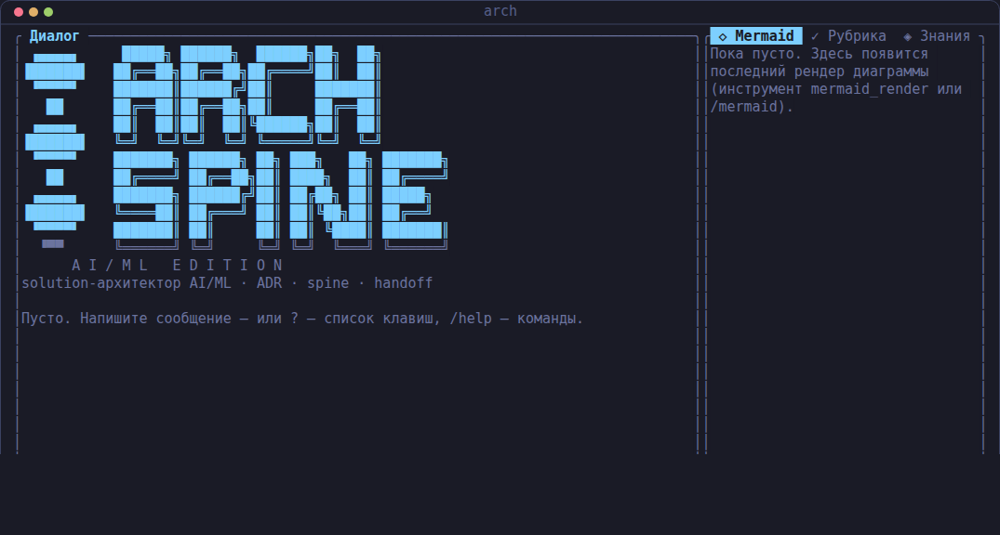
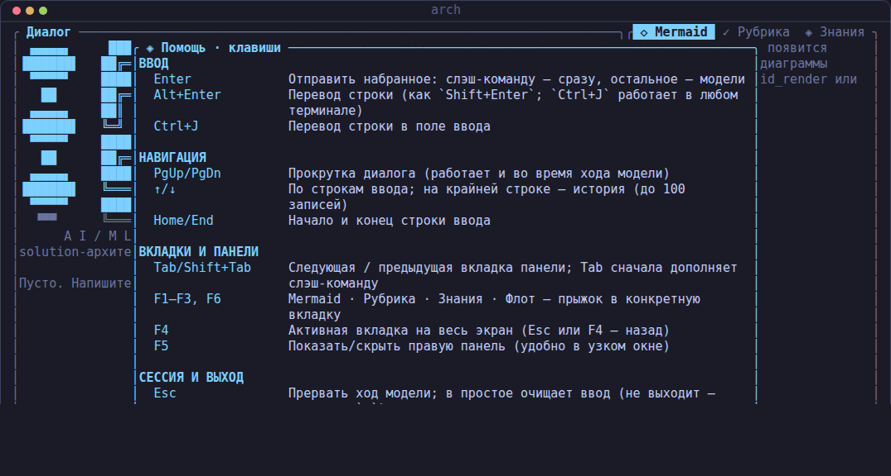
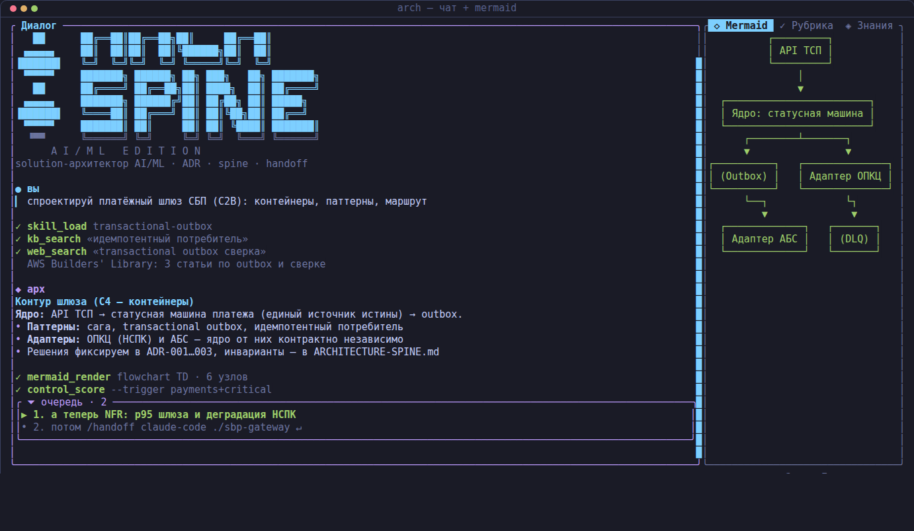
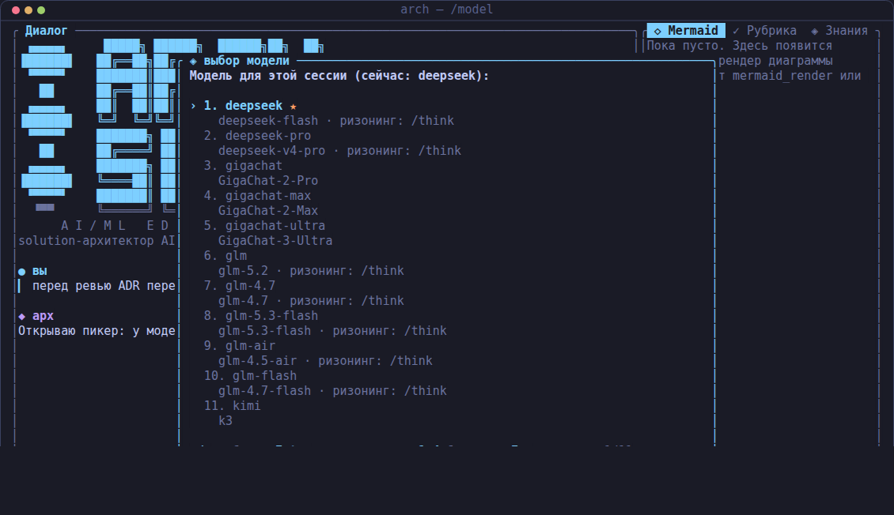
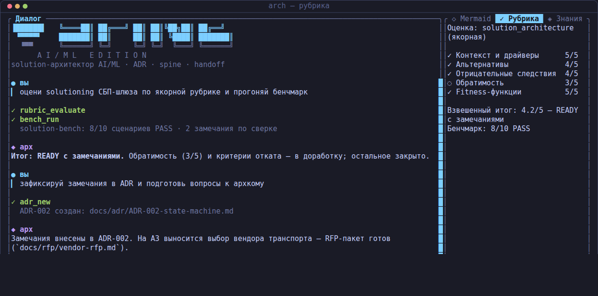
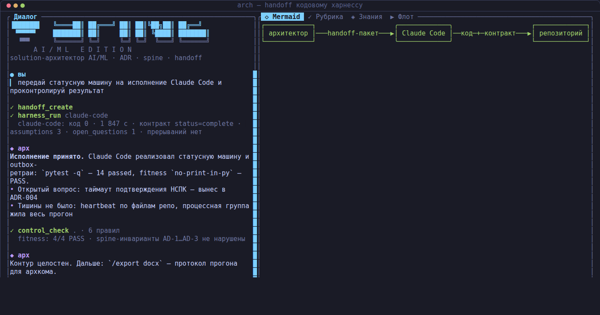

# Интерактивный TUI

Гид по ежедневной работе в полноэкранном интерфейсе `arch-ml`: запуск,
раскладка экрана, ход диалога, модели, доменные возможности, история и
экспорт, горячие клавиши. Читатель — архитектор, живущий в терминале.

Реализация: `src/tui.rs` (event loop, акторная модель) и
`src/tui/{app,render,text,theme,caps,keymap}.rs` — ratatui + crossterm.
Тема по умолчанию — Tokyo Night (bg `#1a1b26`, fg `#c0caf5`, cyan
`#7dcfff`, purple `#bb9af7`), светлая — Tokyo Night Day. Оформление
подстраивается под терминал: ярус цвета, Unicode/ASCII, мышь и анимация
(§7). Все клавиши и элементы ниже подтверждены кодом; реестр клавиш —
`src/tui/keymap.rs` (единый источник подсказок и справки `?`); полный
справочник слэш-команд — `docs/slash_commands.md`.

## 1. Запуск и выход

```bash
arch-ml          # TUI — команда по умолчанию (src/main.rs: None | Some(Cmd::Tui) => tui::run)
arch-ml tui      # то же явно
```

Нужен настоящий терминал: без TTY (пайп, CI) запуск завершится ошибкой
«интерактивный режим требует терминал (TTY)» с отсылкой к headless-режиму
(`arch-ml run`, `docs/headless.md`) — `src/tui.rs::TerminalGuard`. Терминал
восстанавливается при любом выходе — RAII-гард + panic hook
(`src/tui.rs::install_panic_hook`), «испорченный» экран после падения
не остаётся.

| Способ выхода | Контекст | Код |
|---|---|---|
| `/quit` | в любое время | `src/agent/slash.rs` → `SlashOutcome::Quit` |
| `q` | пустая строка ввода в чате; справка; экран ошибки | `src/tui/app.rs::handle_chat_key` |
| `Ctrl-C` | всегда, даже во время хода модели | `src/tui/app.rs::handle_key` |
| `Esc` | в простое — только когда терять нечего (см. ниже) | `src/tui/app.rs::handle_chat_key` |

`Esc` в чате имеет три роли по приоритету: во время хода — **прервать
ход**; при непустом вводе — **отложить черновик** (поле очищается, текст
ждёт в слоте, повторный `Esc` возвращает, в пустом поле видно напоминание
«черновик отложен · Esc — вернуть»); в пустом поле с пустым слотом —
**выход**. Отправленный текст не теряется никогда: выйти с набранным
черновиком по `Esc` невозможно.

## 2. Экран



Заставки нет: приложение стартует сразу в рабочем чате, логотип
`ArchSpine` — первый блок диалога и уезжает вверх по мере переписки
(`src/tui/app.rs::new`, `src/tui/render.rs::logo_lines`). Под логотипом на
пустом логе видно состояние «Пусто. Напишите сообщение — или ? — список
клавиш, /help — команды».

### Зоны основного экрана

Раскладка (`src/tui/render.rs::draw_chat`): центр — диалог; справа —
панель вкладок; снизу — строка состояния, поле ввода без рамки и
однострочный статус-бар.

| Зона | Содержимое |
|---|---|
| Диалог (центр, мин. 24 кол.) | Блоки: реплики user/assistant, «мысли» модели, вызовы инструментов, результаты слэш-команд, ошибки. Лимит — 500 блоков (`MAX_BLOCKS`), старые отбрасываются. Вызовы инструментов — компактный «журнал активности»: серия подряд идущих вызовов схлопывается (первые 2 + счётчик + последние 3), каждый вызов — одна строка с именем и кратким действием из аргументов (путь/команда/запрос), итог — одна строка у последнего завершённого и у ошибок; полный вывод — на вкладках правой панели. Когда история длиннее экрана, в заголовке справа — счётчик позиции `строка/всего`, слева — полоса скролла; поиск по диалогу — `Ctrl+F` (§7). |
| Правая панель | Вкладки `◇ Mermaid` / `✓ Рубрика` / `◈ Знания` / `▶ Флот`: последний рендер диаграммы, отчёт рубрики, результат поиска, dashboard прогона флота. Ширина адаптивная, кап 60% экрана; `F5` скрывает панель целиком (узкие терминалы). |
| Строка состояния | Появляется только когда есть что сказать: «⠸ модель думает · Esc — прервать», «очередь: N». В простое места не занимает. |
| Поле ввода | Без рамки: `› ` и текст. Многострочное, растёт до 8 видимых строк (`MAX_INPUT_ROWS`), дальше окно следует за курсором. Ghost-подсказка автодополнения слэш-команд. |
| Статус-бар | Бейдж модели (с маркером ризонинга `●`/`○off`), индикатор контекста, тост последнего действия, служебные заметки, счётчик фоновых субагентов, cwd и подсказки клавиш из реестра. В узком окне место делится по важности: подсказки → индикаторы → cwd (cwd уходит первым). |

Во время хода модели над вводом горит «дышащая» точка `· • ●` (пульс
~2,9 с) и подсказка `Esc — прервать` (`src/tui/render.rs::draw_input_state`).

### Справка `?`



`?` открывает оверлей со всеми клавишами текущего экрана, сгруппированными
по задаче: ВВОД / НАВИГАЦИЯ / ВКЛАДКИ И ПАНЕЛИ / СЕССИЯ И ВЫХОД. Фокус
заперт — набор текста в справке в поле ввода не попадает; листается
стрелками и `PgUp`/`PgDn`; закрывается `?`, `Esc` или `q`
(`src/tui/render.rs::draw_help`, реестр — `src/tui/keymap.rs`). `/help`
печатает другое — каталог слэш-команд агента.

### Минимальный размер окна

Меньше 60×16 (значения — `[tui] min_width/min_height`) показывается
заглушка: «Терминал мал · сейчас 59×15 · нужно 60×16 · Разверните окно —
или q для выхода». Панели не пытаются ужаться в кашу
(`src/tui/render.rs::draw_too_small`). Экран фатальной ошибки рисуется и в
маленьком окне: причина сбоя важнее минимума.

### Статус-бар: как читать индикатор контекста

Формат (`src/tui/render.rs::context_spans`):

```
 deepseek 🧠  ◈ 12.3k/1.0M ▰▰▱▱▱▱▱▱ 1%   ~/work/payment-svc  · ⠋ субагенты: 2
```

- `◈ <использовано>/<бюджет>` — грубая оценка токенов истории против
  эффективного бюджета контекста: `min(agent.context_budget_tokens,
  context_limit активной модели)` (`AgentSession::effective_context_budget`).
  Размеры человекочитаемые: `999`, `12.3k`, `1.0M`. Если бюджет модели
  неизвестен — просто `◈ ~N ток.`.
- Шкала из 8 ячеек и процент — доля заполнения окна. Цвет — по порогам
  автокомпактификации из конфига (`[agent] compact_l1_pct = 70`,
  `compact_l3_pct = 95`, дефолты `src/config.rs`): **зелёный** — до 70 %,
  **оранжевый** — 70–95 % (на 70 % срабатывает L1-маскирование старых
  tool-результатов), **красный** — за 95 % (L3-саммари истории уже
  близко или идёт). Индикатор обновляется живьём по ходу длинного хода
  (событие `AgentEvent::ContextUsage`).
- Бейдж модели: имя провайдера и модель; суффикс `🧠` — ризонинг включён
  явно (`/think on`), `🧠off` — выключен явно (`src/tui/app.rs::on_session_back`).
- `· <текст>` после cwd — служебные заметки (ошибки MCP, результат
  копирования в буфер обмена).

### Режимы

Экранов два (`Screen` в `src/tui/app.rs`): **Chat** (стартовый и рабочий)
и **Fatal** — фатальная ошибка инициализации модели/конфига с подсказкой
про `arch-ml init` и `api_key_env`, копированием текста ошибки по `c` и
выходом по `q`/`Esc`/`Enter`. Поверх чата могут открываться слои:
модальная панель выбора (пикер модели, пикер сессии, вопрос инструмента
`propose_options`), полноэкранный просмотрщик вкладки (`F4`), справка
(`?`), плавающая карточка очереди сообщений.

## 3. Ход диалога



Enter отправляет ввод: слэш-команда — в `slash::execute`, остальное —
модели. Ход выполняется в фоновой задаче (`tokio::spawn`), сессия
«переезжает» в задачу и возвращается сообщением; UI не блокируется
(`src/tui/app.rs::start_turn`). Что видно на экране по событиям
`AgentEvent`:

- **Стриминг**: ответ печатается дельтами по мере генерации; «мысли»
  модели (`reasoning_content`) копятся в отдельном приглушённом блоке до
  видимого ответа.
- **Инструменты**: каждый вызов — блок с именем и состоянием
  (выполняется / ok / ошибка) и первой строкой вывода. Вывод mermaid-,
  rubric- и kb/web-инструментов дополнительно уходит на свою вкладку
  правой панели (`route_tool_output`).
- **Mermaid-арт в терминале**: инструмент `mermaid_render` и команда
  `/mermaid` рендерят диаграмму в Unicode/ASCII прямо в диалоге и на
  вкладку `◇ Mermaid`. Широкий арт не переносится — клипается, а панель
  показывает хинт «F4 — вся схема»: полноэкранный просмотрщик с
  горизонтальной панорамой (`←/→`, сдвиг по 8 колонок). Это черновой
  контур; презентационные диаграммы — Archify (`docs/archify.md`).
- **Детекторы петель** — заметки `» детектор` системным блоком.

Ввод во время хода не блокируется: **Enter** ставит набранное в очередь
FIFO (видна плавающей карточкой «⏷ очередь», следующее сообщение
подсвечено ▶; максимум 32 сообщения, `MAX_QUEUE`), **Alt+Enter** —
«срочно»: прерывает текущий ход и вклинивает сообщение первым; префикс
`!!` — то же для терминалов без Alt. **Esc** во время хода прерывает его:
обрывается LLM-запрос или вызов инструмента (включая ожидание
`harness_run`), висячие tool-вызовы получают результат «прервано» —
история сессии остаётся консистентной (`interrupt_turn`,
`AgentSession::set_cancel_token`).

Прокрутка (`PgUp/PgDn`, колесо мыши) работает и во время хода; кнопка «▼»
в правом нижнем углу диалога — прыжок к свежему ответу.

## 4. Модели и ризонинг



**Пикер** — `/model` без аргумента (`src/tui/app.rs::open_model_picker`):
модальная панель со списком `[models]` из конфига; описание варианта —
id модели и метка «· ризонинг: /think», если у модели есть карта
`thinking_on`. Текущая модель отмечена ★ и выбрана курсором. Навигация —
`↑/↓`/`j/k`, `Home/End`, `Enter`, цифры — быстрый выбор, `Esc` — отмена.
Выбор сводится к обычному `/model <name>`; с аргументом модель
переключается на лету, минуя пикер (`AgentSession::set_provider`).

**Ризонинг** — `/think on|off|auto`: `on`/`off` сливают в тело запроса
карту `thinking_on`/`thinking_off` из конфига модели (у DeepSeek V4 и
GLM-4.x это `thinking.type`, у Kimi K3 — `reasoning_effort`), `auto` —
дефолт провайдера, параметры не шлются. Состояние видно в бейдже модели
(`🧠` / `🧠off`). Без аргумента `/think` показывает статус и фактические
карты. Матрица моделей и карт — `docs/models.md`.

Та же механика пикера — у `/resume` без аргумента: журналы сессий из
`paths.sessions_dir`, новые первыми, текущая скрыта; описание — дата,
число сообщений, первая реплика.

## 5. Ключевые возможности

Слэш-команды сгруппированы так (полный справочник с синтаксисом и
примерами — `docs/slash_commands.md`; `/help` в TUI печатает тот же
каталог, он же — источник автодополнения по Tab):

| Группа | Команды |
|---|---|
| Сессия и модель | `/help` `/model` `/think` `/clear` `/new` `/compact` `/quit` `/sessions` `/resume` `/save` `/load` `/memory` `/lessons` |
| Плагины и скиллы | `/skills` `/skill` `/plugins` `/agents` `/distill` |
| Архитектурные артефакты | `/mermaid` `/adr` `/spine` `/score` |
| Оценка и бенчмарки | `/rubric` `/bench` |
| Знания и веб | `/kb` `/web` `/fetch` `/sites` |
| Харнессы и контроль | `/handoff` `/control` `/worktree` `/agentsmd` `/mcp` `/doctor` |
| Экспорт | `/export` (обрабатывается самим TUI, см. §6) |

### Рубрики

`/rubric list` — якорные рубрики каталога `assets/rubrics`; `/rubric run
<name> <file>` — оценка файла LLM-судьёй: markdown-отчёт выводится блоком
в чат и одновременно на вкладку `✓ Рубрика` — диалог и артефакт видны
рядом. Подробности о рубриках, судье и бенчмарках —
`docs/rubrics_and_benchmarks.md`.



### Скоринг значимости

`/score [триггер=true …]` — Architecture Significance Score: без
аргументов справка по 15 триггерам, с аргументами — балл и маршрут
Fast/Standard/Critical. Детерминированно, без LLM; та же механика лежит
под fitness-гейтами `arch-ml control`. Правила и триггеры —
`docs/control.md`.

### Handoff

`/handoff <harness> <repo> [task…]` — сборка handoff-пакета
`.arch-handoff/` в репозитории кодового харнесса (TASK.md, спайн,
CONSTRAINTS.yaml, скиллы). Дальше прогон исполнителя — инструмент
`harness_run` (через чат) или `arch-ml harness-run`; целостность результата
проверяется `/control <repo>`. Пошаговый сценарий с кадрами —
`docs/handoff_walkthrough.md`, контракт пакета —
`docs/harness_integrations.md`.



### Worktree-фабрика

Изоляция параллельной агентной работы в git worktree (ветки `arch/*`).
`/worktree` — список worktree текущего репозитория (имя, путь, на
сколько коммитов впереди, чистый/грязный); создание — инструментом
`worktree_new` через агента или `arch-ml worktree new <name>`; review —
`arch-ml worktree diff`, accept/drop — человеком. Инструменты —
`docs/tools.md`.

### Фоновые субагенты

Запуск — через агента фразой «запусти <имя> на <задачу>» (инструмент
`subagent_run`; спецификации — `agents/*.md` плагинов). Пока задачи
работают, статус-бар показывает спиннер и счётчик «⠋ субагенты: N» (там
же учитываются ralph-циклы — они делят слоты, `src/tui/app.rs::needs_tick`).
По завершении (статусы running/done/failed, `src/subagent.rs`) в диалог
падает системный блок `» фон`, а отчёт автоматически ставится в очередь
агенту — вердикты не теряются, даже если вы молчите
(`on_background_finished`). Статусы и превью отчётов — `/agents`,
забрать отчёт pull-путём — инструмент `subagent_result`. Устройство
плагинов и субагентов — `docs/plugins_and_skills.md`.

## 6. История, буферы, экспорт

- **Журнал сессии** — append-only JSONL в `paths.sessions_dir` (по
  умолчанию `~/.arch-ml/sessions`): единственный источник аудита
  (AD-5). `/new` ротирует журнал — старый закрывается `session_end`,
  диалог продолжается в новом файле; прошлые журналы — `/sessions`,
  восстановление истории — `/resume` (пикер или `last`).
- **История ввода** — до 100 строк (`MAX_HISTORY`), навигация `↑/↓` на
  крайней строке многострочного ввода; автодополнение слэш-команд по Tab
  (кандидаты — из каталога `slash::catalog()`, дополняется только первое
  слово, `src/tui/text.rs::completion_candidates`).
- **Буфер обмена**: драг левой кнопкой по диалогу выделяет текст, на
  отпускании выделенное копируется (`src/clipboard.rs`), статус-бар
  отвечает «✓ скопировано N симв.».
- **`/save <file>`** — транскрипт сессии в markdown.
- **`/export <word|excel> [путь]`** — текущий экран диалога в
  `.docx`/`.xlsx` (валидные минимальные OOXML-пакеты; mermaid-арт в Word
  идёт моноширинным Courier New). Обрабатывается самим TUI
  (`src/tui/app.rs::do_export` — слэш-слой про экран не знает); без пути
  файл пишется в рабочий каталог как `arch-screen-<штамп>.<ext>`.
- Из shell, без TUI, выгрузка прошлой сессии из журнала:

```bash
arch-ml export <word|excel> <session.jsonl> <out.docx|out.xlsx>
```

## 7. Горячие клавиши

Только подтверждённые обработчиками crossterm в `src/tui/app.rs`
(`handle_key`, `handle_chat_key`, `handle_ask_key`, `handle_viewer_key`,
`handle_help_key`, `handle_mouse`) и объявленные в реестре
`src/tui/keymap.rs`. Из реестра собираются и строка подсказок, и справка
`?` — рассинхрон «код умеет одно, подсказки говорят другое» ловится
тестами.

### Общие

| Клавиша | Действие |
|---|---|
| `Ctrl-C` | выход (всегда) |
| `q` | выход при пустом вводе; закрывает справку; выход на экране ошибки |
| `?` | справка по клавишам текущего экрана (§2) — при ПУСТОМ вводе; при непустом вводе `?` печатается как обычный символ (вопросы вводятся свободно) |
| `Esc` | прервать ход → отложить/вернуть черновик → выход; в модалке — отмена; в просмотрщике — назад |
| `PgUp` / `PgDn` | прокрутка диалога (работает и во время хода) |
| `Ctrl+F` | поиск по диалогу (см. ниже) |
| `Tab` / `Shift+Tab` | следующая / предыдущая вкладка правой панели |
| `F1` / `F2` / `F3` / `F6` | вкладки Mermaid / Рубрика / Знания / Флот |
| `F4` | полноэкранный просмотрщик активной вкладки (и выход из него) |
| `F5` | скрыть/показать правую панель |

### Поле ввода

| Клавиша | Действие |
|---|---|
| `Enter` | отправить; во время хода — в очередь (FIFO) |
| `Alt+Enter` во время хода | «срочно»: прервать ход и вклинить сообщение первым (префикс `!!` — то же без Alt) |
| `Shift+Enter` / `Alt+Enter` вне хода / `Ctrl+J` | перевод строки (`Ctrl+J` работает в любом терминале) |
| `Tab` | автодополнение слэш-команды; если дополнять нечего — следующая вкладка правой панели |
| `↑` / `↓` | по строкам ввода; на крайней строке — история команд |
| `←` / `→` / `Home` / `End` / `Backspace` / `Delete` | редактирование |

### Справка (`?`)

| Клавиша | Действие |
|---|---|
| `↑/↓`, `PgUp`/`PgDn`, `Home`/`End` | прокрутка справки |
| `?` / `Esc` / `q` | закрыть справку и вернуться в чат |

### Поиск по диалогу (`Ctrl+F`)

`/` занят слэш-командами, поэтому поиск живёт на `Ctrl+F` (E4). Строка
открывается над полем ввода и перехватывает клавиши; панель и статус-бар
остаются живыми. Работает и во время хода модели.

| Клавиша | Действие |
|---|---|
| буквы / `Backspace` | запрос посимвольно; совпадения пересчитываются каждый кадр (регистронезависимо) |
| `Enter` | к следующему совпадению (по кругу) |
| `Alt+Enter` | к предыдущему совпадению |
| `Esc` | закрыть строку поиска (подсветка и позиция прокрутки остаются) |

Текущее совпадение выделяется акцентной плашкой (оранжевой), остальные —
приглушённой; диалог сам центрирует текущее. Счётчик `текущее/всего` — в
строке поиска, позиция в истории `строка/всего` — в заголовке «Диалог»
справа (когда история длиннее экрана).

### Модальные панели (пикер модели, пикер сессии, `propose_options`)

| Клавиша | Действие |
|---|---|
| `↑/↓` или `j/k`, `Home`/`End` | навигация |
| `Enter` | подтвердить выбор |
| `1`–`9` | быстрый выбор по номеру |
| `Esc` | отмена (для `propose_options` — пустой ответ, «реши сам») |

### Просмотрщик вкладки (`F4`)

| Клавиша | Действие |
|---|---|
| `↑/↓`, `PgUp`/`PgDn` | вертикальная прокрутка |
| `←/→` | горизонтальная панорама широкого арта (шаг 8 колонок) |
| `Home` | в верхний левый угол |
| `F1`–`F3` | сменить вкладку, не выходя |
| `Esc` / `q` / `F4` | назад |

### Мышь

| Действие | Результат |
|---|---|
| Колесо | прокрутка диалога (3 строки за тик; в просмотрщике — вертикаль, с `Shift` — горизонталь) |
| Драг левой кнопкой по диалогу | выделение; на отпускании — копирование в буфер обмена |
| Клик по «▼» в правом нижнем углу диалога | прыжок к свежему ответу |

Мышь захватывается по умолчанию; `--no-mouse` (или `[tui] mouse = false`)
возвращает выделение текста терминалу. Все действия мыши продублированы
клавиатурой.

## 8. Оформление и совместимость

Возможности терминала определяются при старте (`src/tui/caps.rs`) по
окружению, а приоритет такой: **флаги CLI → переменные окружения →
`[tui]` конфига → эвристика**.

| Признак | Что меняется |
|---|---|
| `COLORTERM=truecolor\|24bit` | полный цвет (Tokyo Night) |
| `TERM=*256color` | 256 индексированных цветов |
| прочий `TERM` | базовые 16 цветов ANSI (фон не переопределяем) |
| `NO_COLOR`, `TERM=dumb` | без цвета: смысл несут символы и атрибуты |
| `LANG`/`LC_ALL`/`LC_CTYPE` без `UTF-8`, `--ascii` | ASCII-фолбэк: рамки `+-\|`, спиннер `\|/-\`, шкала `#-` |
| `COLORFGBG` (bg ≥ 7) | светлая палитра Tokyo Night Day |
| `SSH_CONNECTION`/`SSH_TTY` | без анимации: статичные индикаторы |

| Флаг | Действие |
|---|---|
| `--theme dark\|light\|auto\|high-contrast` | палитра; `auto` — по фону терминала; `high-contrast` — без цвета и dim, смысл несут bold/reverse (для слабовидящих, `tui-accessibility-compat` §7) |
| `--no-color` | отключить цвет |
| `--ascii` | ASCII-рамки и глифы |
| `--no-mouse` | не захватывать мышь |
| `--no-animation` | статичные индикаторы вместо спиннера |

То же в конфиге: `[tui] theme = "high-contrast"`.

Контраст обеих палитр проверяется тестом по WCAG (обычный текст ≥ 4.5:1,
вторичный ≥ 3:1).

## 9. Какая поверхность когда

| Задача | Поверхность | Почему |
|---|---|---|
| Исследование, проектирование, диалог с артефактами (диаграммы, рубрики, знания на панелях) | **TUI** (`arch-ml`) | единственная поверхность с панелями, пикерами, очередью и живым индикатором контекста |
| Разовый вопрос из скрипта, генерация файла ответом, пайпы | `arch-ml run -q "…" > out.md` | строгий headless-контракт: stdout — только финальный ответ, прогресс молчит |
| Гейты CI: fitness-контроль, валидация диаграмм, doctor | `arch-ml control check`, `arch-ml archify validate`, `arch-ml doctor` | детерминированно, без LLM, exit code 1 при нарушениях |
| Вызовы из кода (Python/Rust/Java) | SDK (`sdk/`) | тонкие клиенты поверх headless CLI, типизированный контракт v1 (`sdk/CONTRACT.md`) |
| Регламентные задачи по расписанию | `arch-ml cron` + системный cron | md-задачи планировщика (`docs/cron_and_md_pipes.md`) |
| Архитектурный контроль из кодовых агентов (Claude Code и др.) | `arch-ml mcp serve` | MCP-сервер stdio: `spine_lint`, `fitness_check`, `significance_score` и др. (ADR-008, `docs/mcp.md`) |

Правило большого пальца: всё, где человек смотрит и правит по ходу, —
TUI; всё, что вызывает машина (скрипт, CI, cron, другой агент), —
headless CLI, SDK или MCP.

## См. также

| Документ | О чём |
|---|---|
| `docs/slash_commands.md` | полный справочник слэш-команд |
| `docs/tui-ux-review.md` | UX-ревью по чеклисту скиллов: проблемы, макеты, матрица окружений |
| `docs/adr/ADR-043-yazyk-dizayna-tui.md` | решения по языку дизайна: справка, черновик, деградация оформления |
| `docs/getting_started.md` | от сборки до первого прогона |
| `docs/headless.md` | headless-режим: процесс как протокол, пайпы, CI |
| `docs/architecture.md` | устройство харнесса и агентного цикла |
| `docs/models.md` | модели, провайдеры, карты ризонинга |
| `docs/tools.md` | справочник инструментов агента |
| `docs/rubrics_and_benchmarks.md` | рубрики, судья, бенчмарки |
| `docs/control.md` | скоринг, spine-линтер, fitness-гейты |
| `docs/handoff_walkthrough.md` | handoff кодовому харнессу пошагово |
| `docs/harness_integrations.md` | контракт пакета `.arch-handoff/` |
| `docs/plugins_and_skills.md` | плагины, скиллы, субагенты |
| `docs/mcp.md` | MCP: клиент и сервер |
| `docs/cron_and_md_pipes.md` | планировщик md-задач |
| `docs/archify.md` | контур диаграмм Archify |
| `sdk/CONTRACT.md` | контракт SDK v1 |
